<div align="center">

# 🍽️ Sistema de Gestión de Restaurante

### Trabajo Práctico Integrador - Entrega Final


<br>

**Universidad Nacional de Lanús**

**Carrera:** Licenciatura en Sistemas

**Materia:** Introducción a las Bases de Datos

<hr>

### 👥 Grupo N° 1

**Integrantes**

**Pergola Ana Laura**<br>
**Leandro Lucas Garcia Kristeff Secoff**<br>
**Sebastian Nogues**

<hr>

### 👨‍🏫 Docentes
**Lic. Javier Vescio**<br>
**Lic. Marcelo Wolf**

<hr>

📅 **AÑO 2026**

</div>

<hr>

## 📖 Descripción del Proyecto

Este trabajo práctico consiste en el análisis, diseño e implementación de una base de datos para la gestión integral de un restaurante, **La Casona**.

La solución propuesta permite administrar mesas, mozos, productos, categorías y pedidos, centralizando la información y mejorando el seguimiento de la operación diaria del establecimiento.

## 📖 Justificación de las decisiones de diseño tomadas frente a los requerimientos del cliente.

La solución propuesta permite administrar mesas, mozos, productos, categorías y pedidos, centralizando la información y mejorando el control de la operación diaria del restaurante **La Casona**.

El diseño de la base de datos se realizó con el objetivo de organizar y optimizar la gestión de los pedidos. Se incorporó la entidad **Salón**, que agrupa las **Mesas**, permitiendo administrar su capacidad y estado, y la entidad **Mozo**, para identificar al personal responsable de la atención.

La entidad **Pedido** registra cada orden realizada por los clientes, mientras que **Producto** y **Categoría** estructuran la oferta del restaurante evitando redundancia de datos.

Se incorporó la entidad intermedia **Detalle de Pedido** para resolver la relación muchos a muchos entre pedidos y productos, permitiendo además almacenar la cantidad y el precio correspondiente.

El modelo fue normalizado hasta **3FN** con el objetivo de evitar redundancias e inconsistencias, utilizando claves primarias y foráneas para garantizar la integridad de los datos.

Finalmente, el diseño es escalable y permite incorporar futuras funcionalidades como reservas o facturación sin modificar la estructura principal.

<hr>

## 📂 Contenido del Repositorio

```text
📂 La_Casona
 ┣ 📂 Diagramas
 ┃ ┣ 📄 DER-La-Casona.pdf
 ┃ ┗ 📄 diagrama_conceptual_la_casona.pdf
 ┣ 📂 images
 ┣ 📂 SQL
 ┃ ┣ 📄 01_creacion_de_tablas_restaurante.sql
 ┃ ┣ 📄 02_insercion_datos_restaurante.sql
 ┃ ┣ 📄 03_consultas.sql
 ┃ ┗ 📄 04_dml.sql
 ┗ 📄 README.md
```

<hr>

## 📊 Consultas SQL(JOINs entre múltiples tablas)

##### 📝 Consulta 1
<p>
    <strong style="color:#1b2d49">Mostrar el nombre de la categoría, el nombre del producto, la cantidad solicitada y la fecha del pedido</strong>
</p>

##### 💻 Código SQL

```sql
SELECT categoria.nombre,producto.nombre,detalle_de_pedido.cantidad, pedido.fecha FROM categoria
INNER JOIN producto ON categoria.id_categoria = producto.id_categoria
INNER JOIN detalle_de_pedido ON producto.id_producto = detalle_de_pedido.id_producto
INNER JOIN pedido ON detalle_de_pedido.id_pedido = pedido.id_pedido;
```

##### 📷 Resultado

<p align="center">
  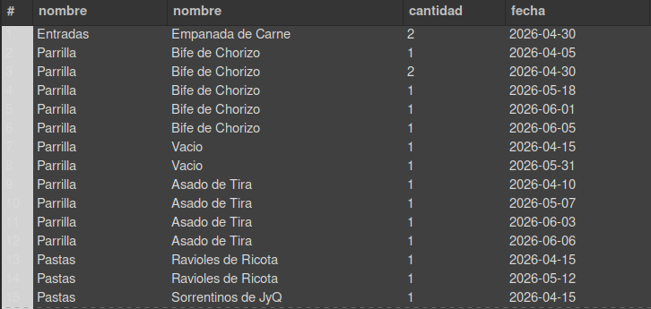
</p>

<hr>

##### 📝 Consulta 2
<p>
    <strong style="color:#1b2d49">Nombre de cada producto con su categoría y precio, ordenado por categoría</strong>
</p>

##### 💻 Código SQL

```sql
SELECT categoria.nombre AS categoria, producto.nombre AS producto, producto.precio FROM producto
JOIN categoria ON producto.id_categoria = categoria.id_categoria
ORDER BY categoria.nombre, producto.nombre;
```

##### 📷 Resultado

<p align="center">
  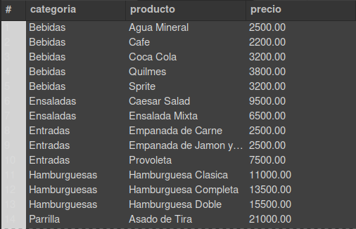
</p>

<hr>


##### 📝 Consulta 3

<p>
<strong style="color:#1b2d49">Mostrar ID y fecha del pedido, nombre del producto, cantidad solicitada y apellido del mozo</strong>
</p>

##### 💻 Código SQL

```sql
SELECT pedido.id_pedido, pedido.fecha, producto.nombre, detalle_de_pedido.cantidad, mozo.apellido
FROM pedido
INNER JOIN detalle_de_pedido ON pedido.id_pedido = detalle_de_pedido.id_pedido
INNER JOIN producto ON detalle_de_pedido.id_producto = producto.id_producto
LEFT JOIN mozo ON pedido.id_mozo = mozo.id_mozo;
```

##### 📷 Resultado

<p align="center">
  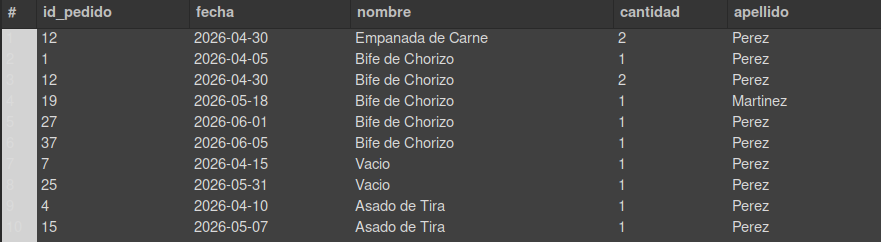
</p>

<hr>

##### 📝 Consulta 4

<p>
<strong style="color:#1b2d49">Listar todas las mesas y los IDs de los pedidos realizados en cada una</strong>
</p>

##### 💻 Código SQL

```sql
SELECT mesa.numero, mesa.capacidad, pedido.id_pedido
FROM mesa
LEFT JOIN pedido ON mesa.id_mesa = pedido.id_mesa
ORDER BY mesa.numero;
```

##### 📷 Resultado

<p align="center">
  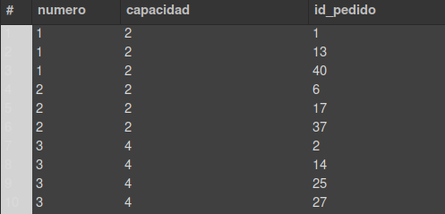
</p>

<hr>

##### 📝 Consulta 5

<p>
<strong style="color:#1b2d49">Mostrar el detalle de todos los pedidos con número de pedido, nombre del producto, cantidad, precio unitario y subtotal</strong>
</p>

##### 💻 Código SQL

```sql
SELECT detalle_de_pedido.id_pedido,
       producto.nombre AS producto,
       detalle_de_pedido.cantidad,
       producto.precio AS Precio_unitario,
       detalle_de_pedido.cantidad * producto.precio AS Subtotal
FROM detalle_de_pedido
INNER JOIN producto
    ON detalle_de_pedido.id_producto = producto.id_producto
ORDER BY detalle_de_pedido.id_pedido;
```

##### 📷 Resultado

<p align="center">
  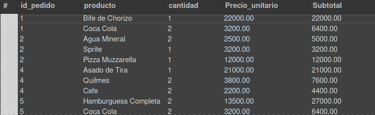
</p>

<hr>

##### 📝 Consulta 6

<p>
<strong style="color:#1b2d49">Mostrar todos los pedidos con número de pedido, nombre del mozo, su legajo y el número de mesa asociada</strong>
</p>

##### 💻 Código SQL

```sql
SELECT pedido.id_pedido AS Pedido, mozo.nombre, mozo.legajo, pedido.id_mesa AS Mesa
FROM pedido
INNER JOIN mozo ON pedido.id_mozo = mozo.id_mozo
INNER JOIN mesa ON pedido.id_mesa = mesa.id_mesa;
```

##### 📷 Resultado

<p align="center">
  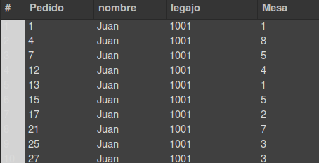
</p>

<hr>

## 📊 Consultas SQL(Filtros (WHERE))

##### 📝 Consulta 1
<p>
    <strong style="color:#1b2d49">Productos de Bebidas o Postres cuyo precio no sea $1500 ni $2000, de mayor a menor precio</strong>
</p>

##### 💻 Código SQL

```sql
SELECT producto.nombre, producto.precio, categoria.nombre AS categoría FROM producto
JOIN categoria ON producto.id_categoria = categoria.id_categoria WHERE categoria.nombre
IN ('Bebidas', 'Postres') AND producto.precio NOT IN (1500, 2000)
ORDER BY producto.precio DESC;
```

##### 📷 Resultado

<p align="center">
  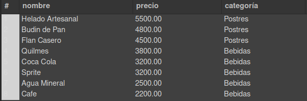
</p>

<hr>

##### 📝 Consulta 2
<p>
    <strong style="color:#1b2d49">Productos con la palabra Pizza en el nombre y precio mayor a $12000</strong>
</p>

##### 💻 Código SQL

```sql
SELECT producto.nombre, producto.precio, categoria.nombre AS categoría FROM producto
JOIN categoria ON producto.id_categoria = categoria.id_categoria WHERE producto.nombre LIKE '%Pizza%' AND producto.precio > 12000
ORDER BY producto.precio DESC;
```

##### 📷 Resultado

<p align="center">
  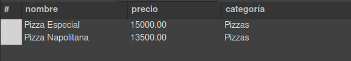
</p>

<hr>

##### 📝 Consulta 3

<p>
<strong style="color:#1b2d49">Productos con precio mayor al promedio general, de mayor a menor</strong>
</p>

##### 💻 Código SQL

```sql
SELECT producto.nombre, producto.precio, categoria.nombre AS categoría FROM producto
JOIN categoria ON producto.id_categoria = categoria.id_categoria
WHERE producto.precio > (SELECT AVG(precio) FROM producto)
ORDER BY producto.precio DESC;
```

##### 📷 Resultado

<p align="center">
  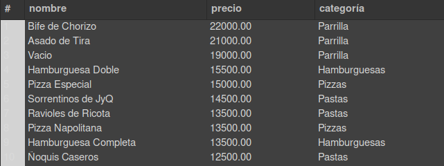
</p>

<hr>

##### 📝 Consulta 4

<p>
<strong style="color:#1b2d49">Mostrar los productos que fueron pedidos alguna vez</strong>
</p>

##### 💻 Código SQL

```sql
SELECT nombre
FROM producto
WHERE id_producto IN (SELECT id_producto FROM detalle_de_pedido);
```

##### 📷 Resultado

<p align="center">
  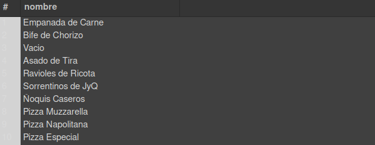
</p>

<hr>

##### 📝 Consulta 5

<p>
<strong style="color:#1b2d49">Mostrar los mozos que registraron pedidos en estado 'Cobrado'</strong>
</p>

##### 💻 Código SQL

```sql
SELECT nombre, apellido FROM mozo
WHERE id_mozo IN (SELECT id_mozo FROM pedido WHERE estado = 'Cobrado');
```

##### 📷 Resultado

<p align="center">
  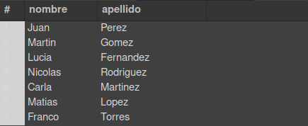
</p>

<hr>

##### 📝 Consulta 6

<p>
<strong style="color:#1b2d49">Mostrar el nombre de los productos que fueron solicitados en mesas con capacidad mayor a 6 personas</strong>
</p>

##### 💻 Código SQL

```sql
SELECT nombre FROM producto
WHERE id_producto IN (SELECT id_producto FROM detalle_de_pedido WHERE id_pedido
IN (SELECT id_pedido FROM pedido WHERE id_mesa
IN (SELECT id_mesa FROM mesa WHERE capacidad > 6)));
```

##### 📷 Resultado

<p align="center">
  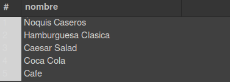
</p>

<hr>


##### 📝 Consulta 7

<p>
<strong style="color:#1b2d49">Pedidos realizados durante mayo que no estén cancelados y que hayan sido registrados por un mozo</strong>
</p>

##### 💻 Código SQL

```sql
SELECT *
FROM pedido
WHERE MONTH(fecha) = 5
  AND (estado != 'Cancelado')
  AND (id_mozo IS NOT NULL);
```

##### 📷 Resultado

<p align="center">
  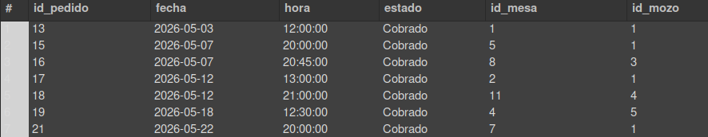
</p>

<hr>

##### 📝 Consulta 8

<p>
<strong style="color:#1b2d49">Productos cuyo precio se encuentre entre $2500 y $5000 y que hayan sido vendidos al menos una vez</strong>
</p>

##### 💻 Código SQL

```sql
SELECT producto.nombre AS Producto, producto.precio
FROM producto
INNER JOIN detalle_de_pedido ON producto.id_producto = detalle_de_pedido.id_producto
WHERE producto.precio BETWEEN 2500 AND 5000;
```

##### 📷 Resultado

<p align="center">
  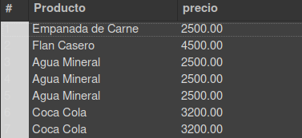
</p>

<hr>

##### 📝 Consulta 9

<p>
<strong style="color:#1b2d49">Pedidos en estado "Cobrado" atendidos por los mozos 3 o 5, con número de pedido, fecha, hora, estado y datos del mozo</strong>
</p>

##### 💻 Código SQL

```sql
SELECT pedido.id_pedido, mozo.nombre, mozo.apellido, pedido.fecha, pedido.hora, pedido.estado
FROM pedido
INNER JOIN mozo ON pedido.id_mozo = mozo.id_mozo
WHERE (mozo.id_mozo = 3 OR mozo.id_mozo = 5)
  AND estado = 'Cobrado';
```

##### 📷 Resultado

<p align="center">
  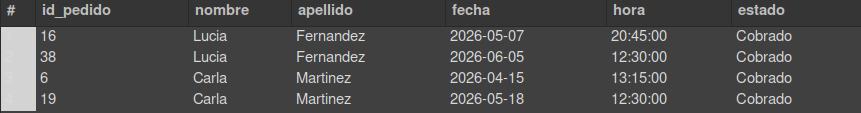
</p>

<hr>

##### 📝 Consulta 10

<p>
<strong style="color:#1b2d49">Mostrar todos los datos de los productos que incluyan la palabra "Pizza" en su nombre y cuyo precio supere los $3500</strong>
</p>

##### 💻 Código SQL

```sql
SELECT nombre, precio
FROM producto
WHERE nombre LIKE '%Pizza%'
  AND precio > 3500;
```

##### 📷 Resultado

<p align="center">
  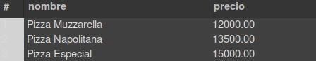
</p>

<hr>

##### 📝 Consulta 11

<p>
<strong style="color:#1b2d49">Productos pertenecientes a la categoría cuyo precio promedio sea el más alto</strong>
</p>

##### 💻 Código SQL

```sql
SELECT p.nombre,
       p.precio,(
           SELECT c.nombre
           FROM categoria c
           WHERE c.id_categoria = p.id_categoria) AS categoria
FROM producto p
WHERE p.id_categoria = ( SELECT id_categoria FROM producto
    GROUP BY id_categoria
    ORDER BY AVG(precio) DESC
    LIMIT 1 );
```

##### 📷 Resultado

<p align="center">
  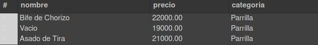
</p>

<hr>

##### 📝 Consulta 12

<p>
<strong style="color:#1b2d49">Productos de Entradas con precio mayor a $3000, o que pertenezcan a Pizzas</strong>
</p>

##### 💻 Código SQL

```sql
SELECT producto.nombre, producto.precio, categoria.nombre AS categoría FROM producto
JOIN categoria ON producto.id_categoria = categoria.id_categoria WHERE (categoria.nombre = 'Entradas' AND producto.precio > 3000) OR categoria.nombre = 'Pizzas';
```

<hr>

## 📊 Consultas SQL(Ordenamientos (ORDER BY))

##### 📝 Consulta 1

<p>
<strong style="color:#1b2d49">Cantidad de productos por categoría, de mayor a menor</strong>
</p>

##### 💻 Código SQL

```sql
SELECT categoria.nombre AS categoria, COUNT(producto.id_producto) AS cantidad_productos FROM categoria
LEFT JOIN producto ON categoria.id_categoria = producto.id_categoria
GROUP BY categoria.id_categoria, categoria.nombre
ORDER BY cantidad_productos DESC;
```

##### 📷 Resultado

<p align="center">
  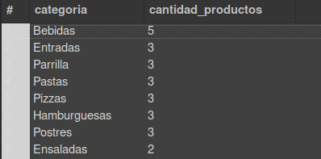
</p>

<hr>


##### 📝 Consulta 2

<p>
<strong style="color:#1b2d49">Recaudación potencial de cada categoría (suma de precios de sus productos), de mayor a menor</strong>
</p>

##### 💻 Código SQL

```sql
SELECT categoria.nombre AS categoria, SUM(producto.precio) AS recaudacion_potencial
FROM categoria
JOIN producto ON categoria.id_categoria = producto.id_categoria
GROUP BY categoria.id_categoria, categoria.nombre
ORDER BY recaudacion_potencial DESC;
```

##### 📷 Resultado

<p align="center">
  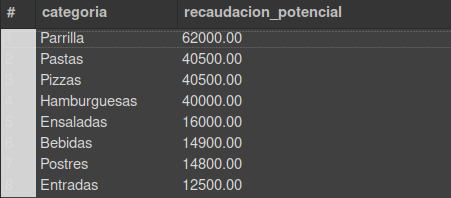
</p>

<hr>

##### 📝 Consulta 3

<p>
<strong style="color:#1b2d49">Mostrar el nombre de cada producto y la cantidad total vendida</strong>
</p>

##### 💻 Código SQL

```sql
SELECT producto.nombre, SUM(detalle_de_pedido.cantidad) AS cantidad_vendida
FROM producto
INNER JOIN detalle_de_pedido ON producto.id_producto = detalle_de_pedido.id_producto
GROUP BY producto.id_producto, producto.nombre
ORDER BY cantidad_vendida DESC;
```

##### 📷 Resultado

<p align="center">
  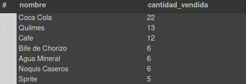
</p>

<hr>


##### 📝 Consulta 4

<p>
<strong style="color:#1b2d49">Listar los mozos ordenados por la cantidad de pedidos atendidos</strong>
</p>

##### 💻 Código SQL

```sql
SELECT mozo.nombre, mozo.apellido, COUNT(pedido.id_pedido) AS pedidos_atendidos
FROM mozo
LEFT JOIN pedido ON mozo.id_mozo = pedido.id_mozo
GROUP BY mozo.id_mozo, mozo.nombre, mozo.apellido
ORDER BY pedidos_atendidos DESC;
```

##### 📷 Resultado

<p align="center">
  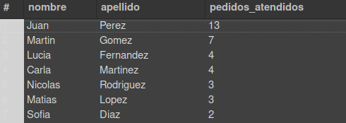
</p>

<hr>

##### 📝 Consulta 5

<p>
<strong style="color:#1b2d49">Mostrar cuántas mesas fueron atendidas por cada mozo, con cantidad de pedidos registrados, ordenado de mayor a menor</strong>
</p>

##### 💻 Código SQL

```sql
SELECT mozo.nombre, mozo.apellido,
       COUNT(DISTINCT pedido.id_mesa) AS mesas_atendidas,
       COUNT(pedido.id_pedido) AS pedidos_registrados
FROM mozo
INNER JOIN pedido ON mozo.id_mozo = pedido.id_mozo
GROUP BY mozo.id_mozo, mozo.nombre, mozo.apellido
ORDER BY COUNT(pedido.id_pedido) DESC;
```

##### 📷 Resultado

<p align="center">
  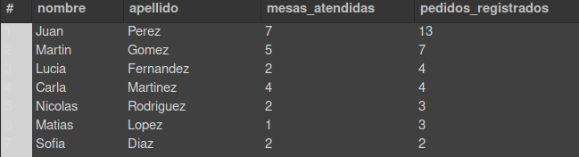
</p>

<hr>

##### 📝 Consulta 6

<p>
<strong style="color:#1b2d49">Mostrar cuánto dinero generó cada mesa durante el período analizado</strong>
</p>

##### 💻 Código SQL

```sql
SELECT mesa.numero AS numero_de_mesa, MONTH(pedido.fecha) AS mes,
       SUM(detalle_de_pedido.cantidad * detalle_de_pedido.precio_unitario) AS total_generado
FROM mesa
INNER JOIN pedido
    ON mesa.id_mesa = pedido.id_mesa
INNER JOIN detalle_de_pedido
    ON pedido.id_pedido = detalle_de_pedido.id_pedido
GROUP BY mesa.id_mesa, mesa.numero, MONTH(pedido.fecha)
ORDER BY total_generado DESC;
```

##### 📷 Resultado

<p align="center">
  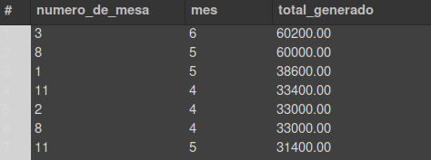
</p>

<hr>

## 📊 Consultas SQL( GROUP BY y funciones de agregacion)

##### 📝 Consulta 1

<p>
<strong style="color:#1b2d49">Categorías vendidas en cada pedido con cantidad total de productos solicitados</strong>
</p>

##### 💻 Código SQL

```sql
SELECT pedido.id_pedido, categoria.nombre AS categoria, SUM(detalle_de_pedido.cantidad) AS total_productos FROM pedido
JOIN detalle_de_pedido ON pedido.id_pedido = detalle_de_pedido.id_pedido
JOIN producto ON detalle_de_pedido.id_producto = producto.id_producto
JOIN categoria ON producto.id_categoria = categoria.id_categoria
GROUP BY pedido.id_pedido, categoria.id_categoria, categoria.nombre
ORDER BY pedido.id_pedido;
```

##### 📷 Resultado

<p align="center">
  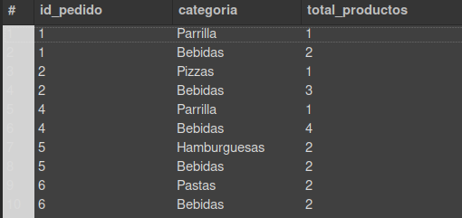
</p>

<hr>

##### 📝 Consulta 2

<p>
<strong style="color:#1b2d49">Listar todos los mozos y la cantidad de pedidos que atendieron</strong>
</p>

##### 💻 Código SQL

```sql
SELECT mozo.nombre, mozo.apellido, COUNT(pedido.id_pedido) AS total_pedidos
FROM mozo
LEFT JOIN pedido ON mozo.id_mozo = pedido.id_mozo
GROUP BY mozo.id_mozo, mozo.nombre, mozo.apellido
ORDER BY total_pedidos DESC;
```

##### 📷 Resultado

<p align="center">
  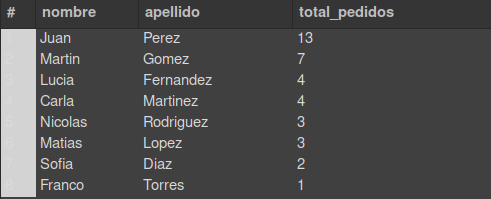
</p>

<hr>

##### 📝 Consulta 3

<p>
<strong style="color:#1b2d49">Cantidad total de productos vendidos por categoría</strong>
</p>

##### 💻 Código SQL

```sql
SELECT categoria.nombre AS categoria, SUM(detalle_de_pedido.cantidad) AS total_vendido
FROM categoria
JOIN producto ON categoria.id_categoria = producto.id_categoria
JOIN detalle_de_pedido ON producto.id_producto = detalle_de_pedido.id_producto
GROUP BY categoria.id_categoria, categoria.nombre
ORDER BY total_vendido DESC;
```

##### 📷 Resultado

<p align="center">
  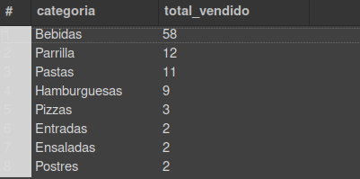
</p>

<hr>

##### 📝 Consulta 4

<p>
<strong style="color:#1b2d49">Mostrar cada salón y la cantidad de pedidos realizados en sus mesas</strong>
</p>

##### 💻 Código SQL

```sql
SELECT salon.nombre, COUNT(pedido.id_pedido) AS cantidad_pedidos
FROM salon
INNER JOIN mesa ON salon.id_salon = mesa.id_salon
LEFT JOIN pedido ON mesa.id_mesa = pedido.id_mesa
GROUP BY salon.id_salon, salon.nombre
ORDER BY cantidad_pedidos DESC;
```

##### 📷 Resultado

<p align="center">
  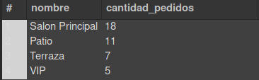
</p>

<hr>

##### 📝 Consulta 5

<p>
<strong style="color:#1b2d49">Calcular el precio promedio de los productos de cada categoría</strong>
</p>

##### 💻 Código SQL

```sql
SELECT categoria.nombre, AVG(producto.precio) AS precio_promedio
FROM categoria
INNER JOIN producto ON categoria.id_categoria = producto.id_categoria
GROUP BY categoria.nombre
ORDER BY precio_promedio DESC;
```

##### 📷 Resultado

<p align="center">
  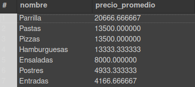
</p>

<hr>

##### 📝 Consulta 6

<p>
<strong style="color:#1b2d49">Cuál es el producto más caro de cada categoría</strong>
</p>

##### 💻 Código SQL

```sql
SELECT categoria.nombre, MAX(producto.precio) AS precio_maximo
FROM categoria
INNER JOIN producto ON categoria.id_categoria = producto.id_categoria
GROUP BY categoria.nombre;
```

##### 📷 Resultado

<p align="center">
  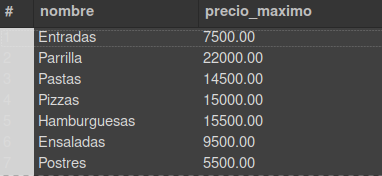
</p>

<hr>

##### 📝 Consulta 7

<p>
<strong style="color:#1b2d49">Mostrar la capacidad mínima de las mesas de cada salón</strong>
</p>

##### 💻 Código SQL

```sql
SELECT salon.nombre, MIN(mesa.capacidad) AS capacidad_minima
FROM salon
INNER JOIN mesa ON salon.id_salon = mesa.id_salon
GROUP BY salon.nombre;
```

##### 📷 Resultado

<p align="center">
  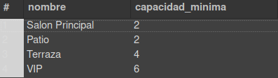
</p>

<hr>


##### 📝 Consulta 8

<p>
<strong style="color:#1b2d49">Mostrar qué productos fueron solicitados en la mesa número 8 con cantidad, precio unitario y total por producto</strong>
</p>

##### 💻 Código SQL

```sql
SELECT mesa.numero AS numero_de_mesa, producto.nombre,
       SUM(detalle_de_pedido.cantidad) AS cantidad_solicitada,
       detalle_de_pedido.precio_unitario,
       SUM(detalle_de_pedido.cantidad * detalle_de_pedido.precio_unitario) AS total
FROM detalle_de_pedido
INNER JOIN pedido ON detalle_de_pedido.id_pedido = pedido.id_pedido
INNER JOIN producto ON detalle_de_pedido.id_producto = producto.id_producto
INNER JOIN mesa ON pedido.id_mesa = mesa.id_mesa
WHERE mesa.numero = 8
GROUP BY mesa.numero, producto.nombre, detalle_de_pedido.precio_unitario;
```

##### 📷 Resultado

<p align="center">
  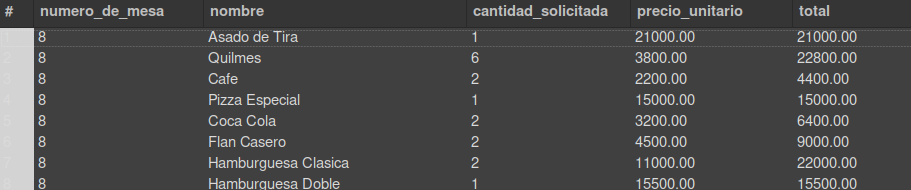
</p>

<hr>


## 📊  Modificación de Datos (INSERT / UPDATE / DELETE)

### ➕ INSERT

##### 📝 DML 1
<p>
<strong style="color:#1b2d49">Se registra una nueva mesa con capacidad 6 y estado "Libre" en el Salón Principal (id_salon = 1)</strong>
</p>

##### 💻 Código SQL

```sql
INSERT INTO mesa (numero, capacidad, estado, id_salon)
VALUES (13, 6, 'Libre', 1);
```

##### 📷 Resultado

<p align="center">
  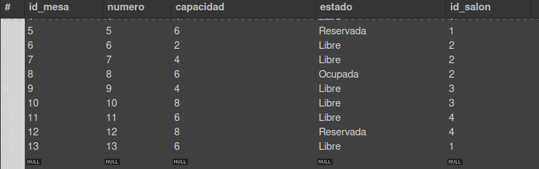
</p>

<hr>

##### 📝 DML 2
<p>
<strong style="color:#1b2d49">Se crear una nueva categoría llamada "Menú Ejecutivo" e insertar al menos un producto asociados, incluyendo su descripción, precio y categoría correspondiente</strong>
</p>

##### 💻 Código SQL

```sql
INSERT INTO categoria (nombre)
VALUES ('Menú Ejecutivo');
```
```sql
INSERT INTO producto (nombre, descripcion, precio, id_categoria)
	VALUES ('Menú Ejecutivo Milanesa 1', 'Milanesa con guarnición y bebida incluida', 4500,
	(SELECT id_categoria FROM categoria WHERE nombre = 'Menú Ejecutivo'));
```

##### 📷 Resultado

<p align="center">
  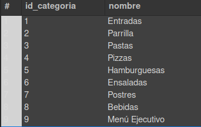
  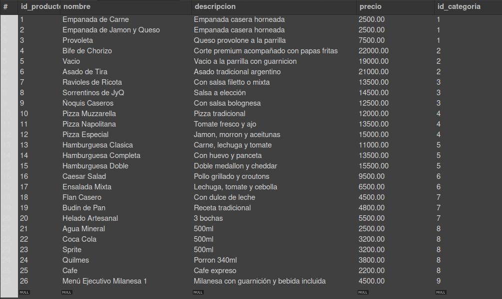
</p>

<hr>

### ✏️ UPDATE

##### 📝 DML 3
<p>
<strong style="color:#1b2d49">Se cambia un pedido de "Pendiente" a "En preparación"</strong>
</p>

##### 💻 Código SQL

```sql
UPDATE pedido SET estado = 'En preparación' WHERE id_pedido = 4;
```

##### 📷 Resultado

<p align="center">
  <p>Antes:</p>
  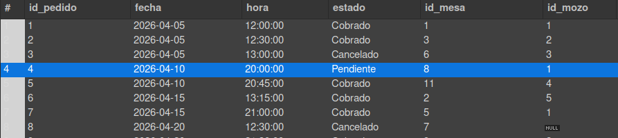
  <br>
  <br>
  <p>Despues:</p>
  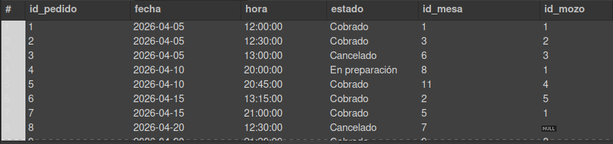
</p>

<hr>

##### 📝 DML 4
<p>
<strong style="color:#1b2d49">Modificar el nombre de una categoría (Ensaladas -> Ensaladas y Verdes)</strong>
</p>

##### 💻 Código SQL

```sql
UPDATE categoria SET nombre = 'Ensaladas y Verdes' WHERE id_categoria = 6;
```

##### 📷 Resultado

<p align="center">
  <p>Antes:</p>
  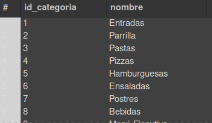
  <br>
  <br>
  <p>Despues:</p>
  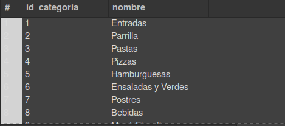
</p>

<hr>

##### 📝 DML 5
<p>
<strong style="color:#1b2d49">Aumentar en 2 la capacidad de las mesas del salón "Terraza"</strong>
</p>

##### 💻 Código SQL

```sql
UPDATE mesa SET capacidad = capacidad + 2 WHERE id_salon IN (SELECT id_salon FROM salon WHERE nombre = 'Terraza');
```

##### 📷 Resultado

<p align="center">
  <p>Antes:</p>
  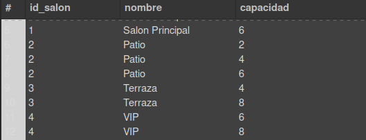
  <br>
  <br>
  <p>Despues:</p>
  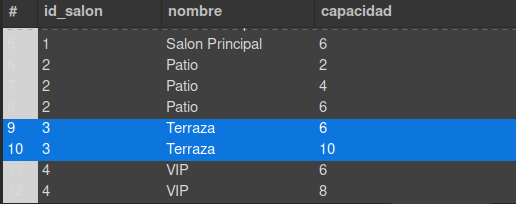
</p>

<hr>

##### 📝 DML 6
<p>
<strong style="color:#1b2d49">Modificar el precio de todos los productos de la categoría "Bebidas", aumentando un 10%</strong>
</p>

##### 💻 Código SQL

```sql
UPDATE producto SET precio = precio * 1.10
WHERE id_categoria IN (SELECT id_categoria FROM categoria WHERE nombre = 'Bebidas');
```

##### 📷 Resultado

<p align="center">
  <p>Antes:</p>
  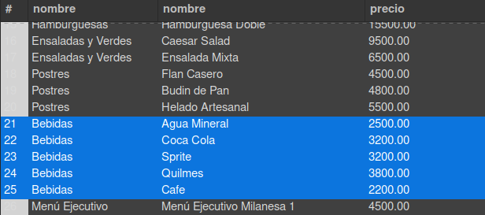
  <br>
  <br>
  <p>Despues:</p>
  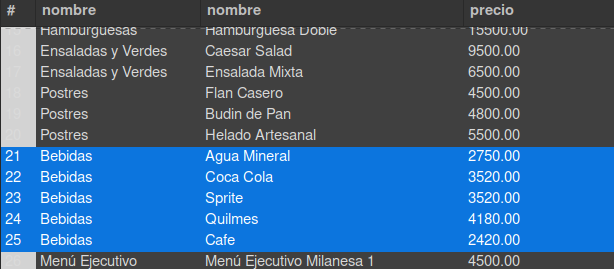
</p>

<hr>

### 🗑️ DELETE

##### 📝 DML 7
<p>
<strong style="color:#1b2d49">Eliminar los pedidos que se encuentren en estado "Cancelado"</strong>
</p>

##### 💻 Código SQL

```sql
DELETE FROM pedido
WHERE estado = "Cancelado";
```

##### 📷 Resultado

<p align="center">
  <p>Antes:</p>
  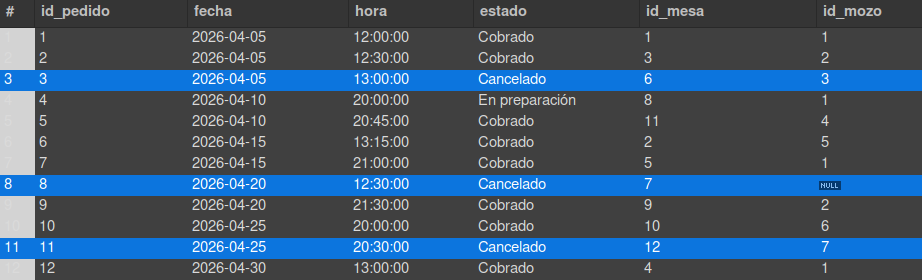
  <br>
  <br>
  <p>Despues:</p>
  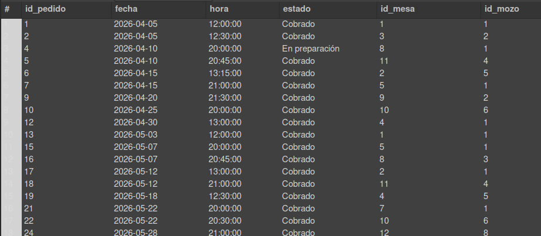
</p>

<hr>

##### 📝 DML 8
<p>
<strong style="color:#1b2d49">Eliminar las mesas que no tengan pedidos registrados</strong>
</p>

##### 💻 Código SQL

```sql
DELETE FROM mesa WHERE id_mesa NOT IN (SELECT id_mesa FROM pedido);
```

<hr>
